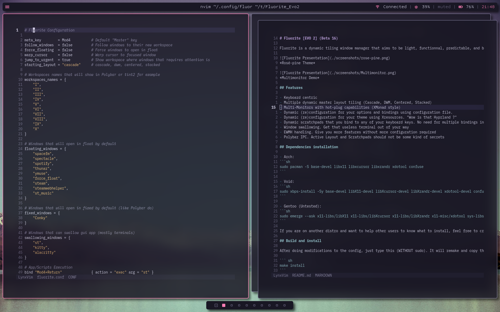
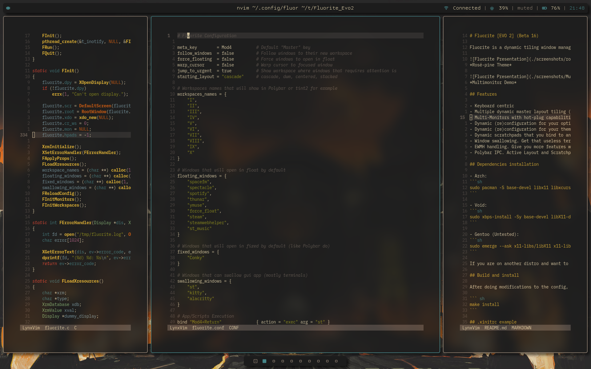

# Fluorite [EVO 2] (Beta 16)

Fluorite is a dynamic tiling window manager that aims to be light, functionnal, predictable, and beautiful.


*Rosé-pine Theme in Cascade layout*


*Gruvbox Theme in Centered layout*

## Features

- Keyboard centric. Faster and easier workflow.
- Multiple dynamic master layout tiling that will suits your daily needs. (Cascade, DWM, Centered, Stacked)
- Multi-Monitors with hot-plug capabilities. Restarting your WM mid-meeting should never happens. (XMonad style)
- Dynamic (re)configuration for your options and bindings using configuration file.
- Dynamic (re)configuration for your theme using Xresources. "Wow is that Hyprland ?"
- Dynamic scratchpads that you bind to any of your keyboard keys. No need for thousands of bindings in your configuration.
- Organizer mode to help you manage your windows arrangement. (PS: Organizer is awesome, but will not manage your life)
- Window swallowing. Get that useless terminal out of your way.
- EWMH handling. Give you more features without more configuration required
- Polybar IPC. Active Layout and Scratchpads should not be some kind of secrets

## Dependencies installation

- Arch: 
```sh
sudo pacman -S base-devel libx11 libxcursor libxrandr xdotool confuse
```

- Void: 
```sh
sudo xbps-install -Sy base-devel libX11-devel libXcursor-devel libXrandr-devel xdotool-devel confuse
```

- Gentoo (Untested): 
```sh
sudo emerge --ask x11-libs/libX11 x11-libs/libXcursor x11-libs/libXrandr x11-misc/xdotool sys-libs/glibc x11-libs/libxcb x11-libs/libXrender x11-libs/libXfixes x11-libs/libXext x11-libs/libXtst x11-libs/libXinerama x11-libs/libxkbcommon x11-libs/libXau x11-libs/libXdmcp dev-libs/confuse
```

If you are on another distro and want to help other users to know what to install, feel free to create a pull request or an issue !

## Build and install

After doing modifications to the config, just type this (WITHOUT sudo). It will remake and copy the Fluorite executable to `/usr/bin/`.

``` sh
make install
```

## .xinitrc example

``` sh
[[ -f ~/.Xresources ]] && xrdb -merge -I$HOME ~/.Xresources # For autoloading your Xresources file
setxkbmap fr
polybar &
picom &
exec Fluorite
```

Keep in mind that the setxkbmap with the proper keyboard layout is *REQUIRED* so you can have all your bindings working.

## Polybar IPC

Fluorite can handle very basic Polybar IPC Modules. Add them in your polybar and set the Fluorite option `POLYBAR_IPC` to `True`.

- Layout
```
[module/fluorite_layout]
type = custom/ipc
hook-0 = "echo Cascade"
hook-1 = "echo DWM"
hook-2 = "echo Centered"
hook-3 = "echo Stacked"
initial = 1 ; Change it to your default layout (1 = Cascade, 2 = DWM, ...)
```

- Scratchpads list
```
[module/fluorite_scratchpads]
type = custom/ipc
hook-0 = xprop -root FLUORITE_SCRATCHPADS 2>/dev/null | awk -F '"' '/=/{print $2}' || echo ""
initial = 1 ; Will check on startup if there is already some Scratchpads
```

## Documentation ?

Go to [Fluorite Website](https://fluorite.surge.sh) for more informations.

You can also find some quick tips inside [CONFIG.md](./CONFIG.md).
