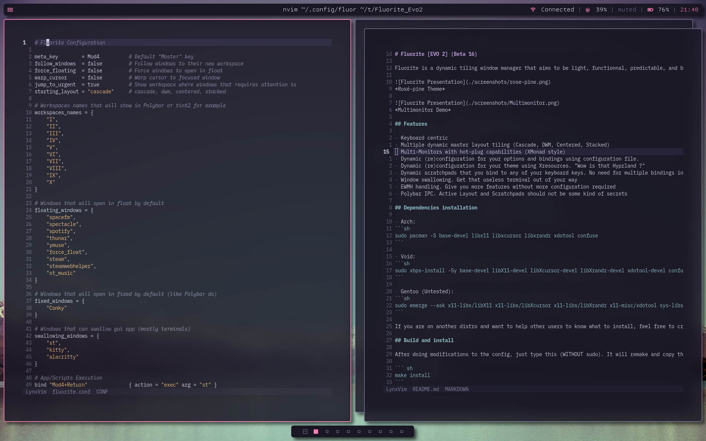
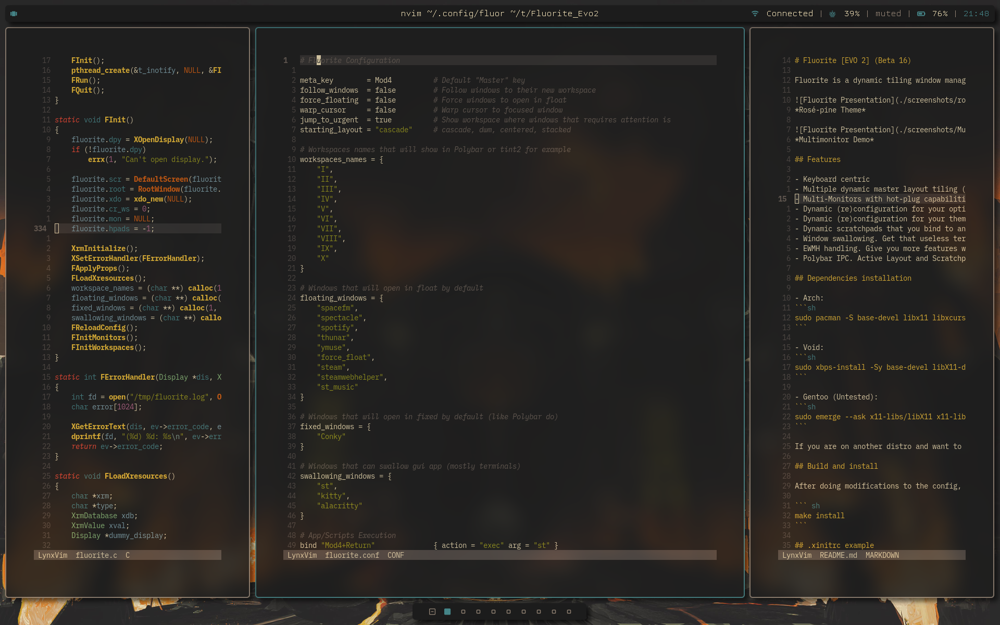

# Fluorite [EVO 3] (Beta 4)

Fluorite is a dynamic tiling window manager that aims to be light, functionnal, predictable, and beautiful.


_Rosé-pine Theme in Cascade layout_


_Gruvbox Theme in Centered layout_

The EVO 3 mostly aim to add all the missing pieces to make a fully X11 compatible window manager to just works. Until now, some edge cases were a bit clunky with Fluorite, but adding new EWMH supports, and finally fully debugging some strange part will help with all this.

Currently the EVO 3 tend to be more compatible with xrandr multi monitors stuff, multi-bar (polybar, quickshell...) setups, and with java apps like Ghidra.

The EVO 3 also now have an ipc controler, it still needs some functionnalities that will help with communication with bars.

## Features

- Keyboard centric. Faster and easier workflow.
- Multiple dynamic master layout tiling that will suits your daily needs. (Cascade, DWM, Centered, Stacked)
- Multi-Monitors with hot-plug capabilities. Restarting your WM mid-meeting should never happens. (XMonad style)
- Dynamic (re)configuration for your options and bindings using configuration file.
- Dynamic (re)configuration for your theme using Xresources. "Wow is that Hyprland ?"
- Dynamic scratchpads that you bind to any of your keyboard keys. No need for thousands of bindings in your configuration.
- Organizer mode to help you manage your windows arrangement. (PS: Organizer is awesome, but will not manage your life)
- Window swallowing. Get that useless terminal out of your way.
- EWMH handling. Give you more features without more configuration required
- Polybar IPC. Active Layout and Scratchpads should not be some kind of secrets
- fluoritectl. Let you control Fluorite from your terminal

## Dependencies installation

- Arch:

```sh
sudo pacman -S base-devel libx11 libxcursor libxrandr xdotool confuse
```

- Void:

```sh
sudo xbps-install -Sy base-devel libX11-devel libXcursor-devel libXrandr-devel xdotool-devel confuse
```

- Gentoo (Untested):

```sh
sudo emerge --ask x11-libs/libX11 x11-libs/libXcursor x11-libs/libXrandr x11-misc/xdotool sys-libs/glibc x11-libs/libxcb x11-libs/libXrender x11-libs/libXfixes x11-libs/libXext x11-libs/libXtst x11-libs/libXinerama x11-libs/libxkbcommon x11-libs/libXau x11-libs/libXdmcp dev-libs/confuse
```

If you are on another distro and want to help other users to know what to install, feel free to create a pull request or an issue !

## Build and install

After doing modifications to the config, just type this (WITHOUT sudo). It will remake and copy the Fluorite executable to `/usr/bin/`.

```sh
make install
```

## .xinitrc example

```sh
[[ -f ~/.Xresources ]] && xrdb -merge -I$HOME ~/.Xresources # For autoloading your Xresources file
setxkbmap fr
polybar &
picom &
exec Fluorite
```

Keep in mind that the setxkbmap with the proper keyboard layout is _REQUIRED_ so you can have all your bindings working.

## Polybar IPC

Fluorite can handle very basic Polybar IPC Modules. Add them in your polybar and set the Fluorite option `POLYBAR_IPC` to `True`.

- Layout

```
[module/fluorite_layout]
type = custom/ipc
hook-0 = "echo Cascade"
hook-1 = "echo DWM"
hook-2 = "echo Centered"
hook-3 = "echo Stacked"
initial = 1 ; Change it to your default layout (1 = Cascade, 2 = DWM, ...)
```

- Scratchpads list

```
[module/fluorite_scratchpads]
type = custom/ipc
hook-0 = xprop -root FLUORITE_SCRATCHPADS 2>/dev/null | awk -F '"' '/=/{print $2}' || echo ""
initial = 1 ; Will check on startup if there is already some Scratchpads
```

## Documentation ?

Go to [Fluorite Website](https://fluorite.surge.sh) for more informations.

You can also find some quick tips inside [CONFIG.md](./CONFIG.md).

## Automated Multi-Monitor Hotplug (with autorandr)

Fluorite seamlessly supports dynamic multi-monitor hotplugging and strut recalculation. To automate display layout switching upon plugging or unplugging monitors, using [`autorandr`](https://github.com/phillipberndt/autorandr) is highly recommended.

### 1. Install autorandr

- **Gentoo**: `sudo emerge -av x11-misc/autorandr`
- **Arch Linux**: `sudo pacman -S autorandr`
- **Void Linux**: `sudo xbps-install -S autorandr`
- **Debian / Ubuntu**: `sudo apt install autorandr`

### 2. Save your display profiles

Configure your screens as desired using `xrandr` (or GUI tools like `arandr`), then save the corresponding profiles:

- **Single / Mobile display (laptop alone)**:
  ```sh
  xrandr --output <EXTERNAL> --off --output <INTERNAL> --auto --primary
  autorandr --save default
  ```
  *(Naming this profile `default` ensures autorandr falls back to it when no external screen is connected).*

- **Multi-Monitor setup (e.g. external display above laptop)**:
  ```sh
  xrandr --output <EXTERNAL> --auto --above <INTERNAL>
  autorandr --save dual-hdmi
  ```

### 3. Setup postswitch hook for wallpaper

To automatically re-apply your wallpaper with `feh` upon profile switching, create `~/.config/autorandr/postswitch`:

```sh
#!/bin/sh
$HOME/.fehbg
```

Make it executable:
```sh
chmod +x ~/.config/autorandr/postswitch
```

### 4. Integrate into `.xinitrc`

Call `autorandr --change` synchronously before starting your bars and Fluorite:

```sh
# Apply matching display profile before starting window manager & bars
autorandr --change --default default

# Start compositor, bars, etc.
~/.fehbg &
picom &
quickshell & # or polybar &

# Start Fluorite
exec Fluorite
```

When udev hotplug triggers (`/usr/lib/udev/rules.d/40-monitor-hotplug.rules`), `autorandr` will automatically detect the hardware change, apply the appropriate profile, run your `postswitch` script, and Fluorite will dynamically update all workspaces, windows, and struts!
